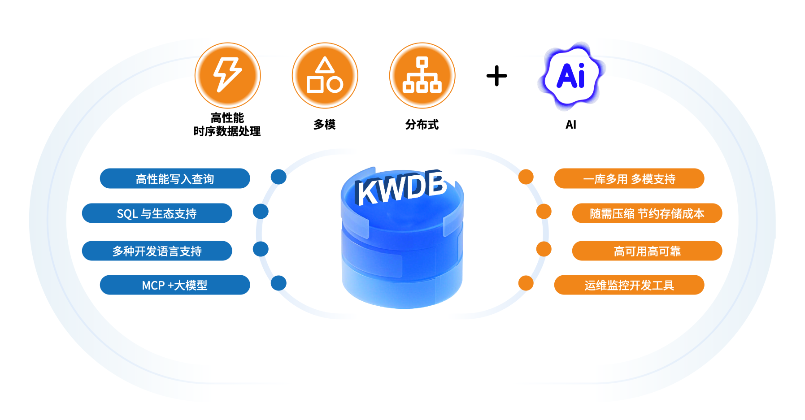

# KWDB

简体中文 | [English](./README.en.md)

## 了解 KWDB

KWDB 是开放原子开源基金会孵化及运营的**面向 AIoT 物联网场景的分布式多模数据库**项目。基于浪潮 KaiwuDB 开源，支持在同一实例同时建立时序库和关系库并融合处理多模数据，具备千万级设备接入、百万级数据秒级写入、亿级数据秒级读取等时序数据高效处理能力，具有稳定安全、高可用、易运维等特点。典型应用场景包括但不限于物联网、能源电力、交通车联网等，旨在为各行业领域提供一站式数据存储、管理与分析的基座，助力企业数智化建设，以更低的成本挖掘更大的数据价值。



KWDB 适配多种场景，为开发者提供：

- 多种通用连接接口，具备高速写入、极速查询、SQL 支持、随需压缩、数据生命周期管理、集群部署等特性，与第三方工具无缝集成，降低开发及学习难度，提升开发使用效率。
- 快速安装部署、升级、迁移、监控等能力，提升数据库运维效率，降低数据库运维管理成本。
- 数据库可视化管理工具、时序数据库基准测试工具、监控指标模板等多种生态工具。
- MCP Server、AI 智能助手和 AI 智能体等多种 AI 赋能工具，帮助用户更高效、更智能的开发和维护 KWDB。

 **关键词**：物联网（IoT）、多模数据库、分布式、时序数据处理、云边端协同

## 快速开始

推荐使用 Docker 快速体验 KWDB：

```bash
docker run -d --privileged --name kwdb \
  -p 26257:26257 \
  -p 8080:8080 \
  -v /var/lib/kaiwudb:/kaiwudb/deploy/kaiwudb-container \
  --ipc shareable \
  -w /kaiwudb/bin \
  kwdb/kwdb \
  ./kwbase start-single-node \
    --insecure \
    --listen-addr=0.0.0.0:26257 \
    --http-addr=0.0.0.0:8080 \
    --store=/kaiwudb/deploy/kaiwudb-container
```

kwbase 是 KWDB 提供的内置命令行工具，用户可以通过 kwbase 连接 KaiwuDB，进行数据库操作和维护。

使用 Docker 连接 KWDB 并开启交互式 SQL Shell：

```bash
docker exec -it kwdb ./kwbase sql --insecure --host=127.0.0.1
```

## 编译和安装

KWDB 支持用户根据需求选择二进制安装包、容器和源码安装 KWDB 数据库：

- **二进制安装包**：支持单机和集群以及安全和非安全部署模式，更多信息见[单节点部署](https://www.kaiwudb.com/kaiwudb_docs/#/oss_dev/quickstart/install-kaiwudb/quickstart-bare-metal.html)和[集群部署](https://www.kaiwudb.com/kaiwudb_docs/#/oss_dev/deployment/overview.html)。
- **容器镜像**：KWDB 提供了多种容器镜像下载渠道，用户可以根据当前网络环境选择合适的镜像，或者直接在 [Release 页面](https://gitee.com/kwdb/kwdb/releases)下载对应版本的后缀为 `-docker.tar.gz` 的压缩包解压并使用 `docker load < KaiwuDB.tar` 命令加载 `kaiwudb_install/packages` 中的镜像。
  - 官方仓库：`kwdb/kwdb`
  - 国内镜像：`swr.cn-north-4.myhuaweicloud.com/ddn-k8s/docker.io/kwdb/kwdb`
  - Github 容器镜像：`ghcr.io/kwdb/kwdb`
- **源码**：源码编译目前支持单节点非安全模式部署。

以下指南以 Ubuntu 22.04 操作系统为例说明如何编译源码和安装 KWDB。

### 操作系统和软件依赖

KWDB 支持在 Linux 操作系统进行安装部署，下表列出了编译和运行 KWDB 所需的软件依赖。

**编译依赖：**

| 依赖              | 版本    | 说明                                                         |
| :---------------- | :------ | ------------------------------------------------------------ |
| ca-certificates   | any     |                                                              |
| Go                | v1.15+  |                                                              |
| CMake             | v3.23   |                                                              |
| Autoconf          | v2.68+  |                                                              |
| goyacc            | v0.8.0+ |                                                              |
| dpkg-dev          | any     | 仅适用Ubuntu系统。                                           |
| devscripts        | any     | 仅适用Ubuntu系统。                                           |
| build-essential   | any     |                                                              |
| checkinstall      | any     |                                                              |
| libssl            | v1.1.1+ | - Ubuntu系统该依赖名为libssl-dev。<br/>- RHEL, CentOS, Kylin, UOS, AnolisOS系统该依赖名为libssl-devel。 |
| libprotobuf       | v3.6.1+ | - Ubuntu系统该依赖名为libprotobuf-dev。<br/>- RHEL, CentOS, Kylin, UOS, AnolisOS系统该依赖名为libprotobuf-devel。 |
| liblzma           | v5.2.0+ | - Ubuntu系统该依赖名为liblzma-dev。<br>- RHEL, CentOS, Kylin, UOS, AnolisOS系统该依赖名为liblzma-devel。 |
| libncurses        | v6.2.0+ | - Ubuntu系统该依赖名为libncurses5-dev。<br>- RHEL, CentOS, Kylin, UOS, AnolisOS系统该依赖名为libncurses-devel。 |
| libatomic         | v7.3.0+ | 仅 GCC 和 G++ 7.3.0 版本需要增加此依赖。                     |
| libstdc++-static  | v7.3.0+ | 仅 GCC 和 G++ 7.3.0 版本需要增加此依赖。                     |
| protobuf-compiler | any     |                                                              |
| git               | any     |                                                              |

**运行依赖：**

| 依赖           | 版本    |
| :-------------| :------ |
| openssl        | v1.1.1+ |
| libprotobuf    | v3.6.1+  <br>**注意**：Ubuntu 18.04 默认的 libprotobuf 版本不满足要求，用户需要提前安装所需版本（推荐 3.6.1 和 3.12.4），并在编译时通过 `make PROTOBUF_DIR=<protobuf_directory>` 指定高版本路径。|
| geos           | v3.3.8+ |
| xz-libs        | v5.2.0+ |
| squashfs-tools | any     |
| libgcc         | v7.3.0+ |
| mount          | any     |
| squashfuse     | any     |

### 环境准备

1. 下载和解压 [CMake 安装包](https://cmake.org/download/)。

   ```Bash
   tar -C /usr/local/ -xvf cmake-3.23.4-linux-x86_64.tar.gz 
   mv /usr/local/cmake-3.23.4-linux-x86_64 /usr/local/cmake
   ```

2. 下载和解压 [Go 安装包](https://golang.google.cn/dl/)。

   ```Bash
   tar -C /usr/local -xvf go1.22.5.linux-amd64.tar.gz
   ```

3. 创建用于存放项目代码的代码目录。

   ```Bash
   mkdir -p /home/go/src/gitee.com
   ```

4. 设置 Go 和 CMake 的环境变量。

   - 个人用户设置：修改`~/.bashrc` 文件
   - 系统全局设置（需要 root 权限）：修改`/etc/profile`文件

      ```Bash
      export GOROOT=/usr/local/go
      export GOPATH=/home/go      #请以实际代码下载存放路径为准，在此以home/go目录为例
      export PATH=$PATH:/usr/local/go/bin:/usr/local/cmake/bin
      ```

5. 使变量设置立即生效：

    - 个人用户设置：

      ```Bash
      source ~/.bashrc                           
      ```

    - 系统全局设置：

      ```Bash
      source /etc/profile                           
      ```

### 下载代码

在 [KWDB 代码仓库](https://gitee.com/kwdb/kwdb)下载代码，并将其存储到 `GOPATH` 声明的目录。

- 使用 git clone 命令：

   ```Bash
   git clone https://gitee.com/kwdb/kwdb.git /home/go/src/gitee.com/kwbasedb #请勿修改目录路径中的 src/gitee.com/kwbasedb
   cd /home/go/src/gitee.com/kwbasedb 
   git submodule update --init  #适用于首次拉取代码
   git submodule update --remote
   ```

- 下载代码压缩包，并将其解压缩到指定目录。

### 构建和安装

1. 在项目目录下创建并切换到构建目录。

   ```Bash
   cd /home/go/src/gitee.com/kwbasedb
   mkdir build && cd build
   ```

2. 运行 CMake 配置。

   ```Bash
   cmake .. -DCMAKE_BUILD_TYPE= [Release | Debug]
   ```

   参数说明：
   `CMAKE_BUILD_TYPE`：指定构建类型，默认为 `Debug`。可选值为 `Debug` 或 `Release`，首字母需大写。

3. 禁用Go模块功能。

   1. 设置环境变量

      - 个人用户设置：修改`~/.bashrc` 文件

      - 系统全局设置（需要 root 权限）：修改`/etc/profile`文件

         ```Bash
         export GO111MODULE=off
         ```

   2. 使变量设置立即生效：

      - 个人用户设置：

         ```Bash
         source ~/.bashrc                           
         ```

      - 系统全局设置：

        ```Bash
        source /etc/profile                           
        ```

4. 编译和安装项目。

   > **提示**：
   > - 如果编译时出现遗留的 protobuf 自动生成的文件导致报错，可使用`make clean` 清理编译目录。
   > - 如果需要额外指定 protobuf 的文件路径，请使用 `make PROTOBUF_DIR=<protobuf_directory>`。

      ```Bash
      make
      make install
      ```

   编译和安装成功后的文件清单如下：

      ```Plain
      /home/go/src/gitee.com/kwbasedb
      ├── install
      │   ├── bin
      │   │   ├── err_inject.sh
      │   │   ├── query_kwbase_status.sh
      │   │   ├── query_status.sh
      │   │   ├── setup_cert_file.sh
      │   │   ├── utils.sh
      │   │   └── kwbase
      │   └── lib
      │       ├── libcommon.so
      │       └── libkwdbts2.so
      ```

5. （可选）进入 kwbase 脚本所在目录，查看数据库版本，验证是否安装成功。

      ```Bash
      ./kwbase version
      KaiwuDB Version:  V2.0.3.2_RC3-3-gfe5eeb853e-dirty
      Build Time:       2024/07/19 06:24:00
      Distribution:
      Platform:         linux amd64 (x86_64-linux-gnu)
      Go Version:       go1.22.5
      C Compiler:       gcc 11.4.0
      Build SHA-1:      fe5eeb853e0884a963fd43b380a0b0057f88fb19
   ```

### 启动数据库

1. 进入 `kwbase` 脚本所在目录。

   ```Bash
   cd /home/go/src/gitee.com/kwbasedb/install/bin
   ```

2. 设置共享库的搜索路径。

   ```Bash
   export LD_LIBRARY_PATH=../lib
   ```

3. 启动数据库。

   ```Bash
   ./kwbase start-single-node --insecure --listen-addr=:26257 --background
   ```

4. 数据库启动后即可通过 kwbase CLI 工具、KaiwuDB 开发者中心或 JDBC 等连接器连接和使用 KWDB，具体连接和使用内容见[使用 kwbase CLI 工具连接 KWDB](https://www.kaiwudb.com/kaiwudb_docs/#/oss_dev/quickstart/access-kaiwudb/access-kaiwudb-cli.html)、[使用 KaiwuDB 开发者中心连接 KWDB ](https://www.kaiwudb.com/kaiwudb_docs/#/oss_dev/quickstart/access-kaiwudb/access-kaiwudb-kdc.html)和[使用 JDBC 连接 KWDB](https://www.kaiwudb.com/kaiwudb_docs/#/oss_dev/quickstart/access-kaiwudb/access-kaiwudb-jdbc.html)。

## 社区

欢迎广大社区用户及开源爱好者 Star & Fork KWDB，并踊跃参与到我们的社区活动之中，携手共同建设社区。若需了解详情，请查阅我们的[社区贡献](https://gitee.com/kwdb/community/blob/master/Contribution_process.md)相关内容。开发者可通过 [Issue]((https://gitee.com/kwdb/kwdb/issues))、[PR](https://gitee.com/kwdb/kwdb/pulls) 以及技术交流群等方式展开沟通协作，助力社区实现更为良好的发展。

## 案例

KWDB 典型应用场景包括但不限于物联网、能源电力、交通车联网、智慧政务、IT 运维、金融证券等，更多信息请参见[应用案例](https://www.kaiwudb.com/case/)。

## 发版说明

请参见[发版说明](https://gitee.com/kwdb/docs/blob/master/release-notes/release-notes.md)。

## 许可证

本项目根据 [MulanPSL2](http://license.coscl.org.cn/MulanPSL2) 许可证授权。

## 声明

KWDB 是由[开放原子开源基金会（OpenAtom Foundation）](https://openatom.org/)孵化及运营的开源项目。


## 合作交流

如果你想和更多 KWDB 的用户互动交流，请扫下方二维码（备注：Gitee），KWDB 官方小助手将协助你加入官方技术交流群。


### 官方渠道

- 官网：https://www.kaiwudb.com
- 开源运营专区：https://kwdb.atomgit.com
- 公众号：KaiwuDB


