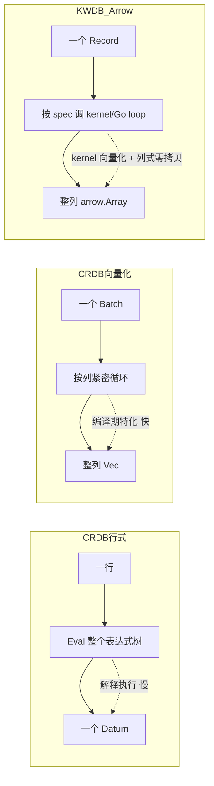

# Arrow 表达式投影实现 vs CRDB 表达式实现 对比流程图

> 本文档对比 KWDB Arrow 统一执行层的表达式（投影）实现与 CRDB 原生两种表达式执行方案：
> 1. **行式（Row-based）**：`execinfra` 的 `renderExprs` + 逐行 `Eval`
> 2. **向量化（colexec）**：代码生成（execgen）的 `coldata.Vec` batch 逐列运算
>
> 三者均服务于同一语义目标：`SELECT f(a, b) FROM t` 中 render/投影表达式求值。

---

## 一、CRDB 行式（Row-based）表达式实现流程

```mermaid
flowchart TD
    A[SQL Planner 生成 PostProcessSpec] --> B[renderExprs: []ExprHelper]
    B --> C[ExprHelper.Init expr + typs + evalCtx]
    C --> D[物理计划下发 processor]

    D --> E[processor.Next: 拉取上游 EncDatumRow]
    E --> F{对每个 renderExpr}
    F --> G[h.renderExprs[i].Eval row]
    G --> H[goevaluate 解释执行 tree.TypedExpr]
    H --> I[返回单个 tree.Datum]
    I --> J[EncDatum 编码入输出行]
    J --> F
    F -->|全部列完成| K[emit 一行 EncDatumRow]
    K --> L[下游或返回客户端]

    style A fill:#e1f5ff
    style H fill:#ffe1e1
    style K fill:#e1ffe1
```

**关键特征**
- 表达式以 `tree.TypedExpr` 形式保留，运行时由 `goevaluate` **解释执行**（reflect + 类型分发）。
- **逐行（row-at-a-time）**：每次 `Next` 取出一行，对每行内每个 render 表达式调用 `Eval`。
- 数据以 `EncDatum`（编码字节 + 可选物理 Datum）在 processor 间流动，跨节点需编解码。
- 实现位置：`pkg/sql/execinfra/processorsbase.go`（`renderExprs` + 行 324–377 的 `Eval` 循环）。

---

## 二、CRDB 向量化（colexec）表达式实现流程

```mermaid
flowchart TD
    A[SQL Planner 生成 render 表达式] --> B[colexec 计划器选中向量化路径]
    B --> C[execgen 模板代码生成专属 Op 结构体]
    C --> D[如 projectionOp / andOrProjectionOp]

    D --> E[Op.Next: 拉取上游 coldata.Batch]
    E --> F[batch 含多列 coldata.Vec 列存向量]
    F --> G{逐列运算，tight loop}
    G --> H[直接读写 Vec 底层 []T 切片]
    H --> I[处理 null bitmap / selection vector]
    I --> G
    G -->|所有列/表达式完成| J[emit 一个 coldata.Batch]
    J --> K[下游或返回]

    style A fill:#e1f5ff
    style C fill:#fff3e1
    style H fill:#e1ffe1
```

**关键特征**
- 通过 **execgen 模板代码生成** 把表达式编译成强类型 Go 循环（如 `and_or_projection.eg.go` 中直接遍历 `leftColVals`/`rightColVals`）。
- **逐列向量化（batch-at-a-time）**：一次 `Next` 处理 1024 行的 `coldata.Batch`，按列做紧凑循环，避免每行反射。
- 数据以 `coldata.Vec`（列式内存）流动，intra-node 零拷贝；仅支持有限表达式集（不支持的全部回退行式）。
- select/null 用 selection vector + nulls bitmap 表达，避免物化掩码。
- 实现位置：`pkg/sql/colexec/*.eg.go`（execgen 产物）。

---

## 三、KWDB Arrow 统一执行层表达式（投影）实现流程

```mermaid
flowchart TD
    A[SQL Planner: canArrowRender 判定] -->|全部表达式可 Arrow 化| B[addArrowRendering 构建 JSON plan]
    A -->|含不支持表达式| Z[回退行式 / colexec]
    B --> C[arrowProjectionPlan.Cols: []arrowProjectionCol]
    C --> D[json.Marshal → ProcessorCoreUnion.ArrowProjection.Expr]
    D --> E[AddNoGroupingStage 下发 Arrow stage]

    E --> F[executor: NewArrowProjection 构建 UnifiedProcessor]
    F --> G[Next: 上游 UnifiedProcessor 拉取 arrow.Record]
    G --> H{对每个 ArrowProjectionSpec.Kind}
    H -->|compute| I[compute.CallFunction kernel 零拷贝]
    H -->|datetime| J[evalArrowDatetimeFunc Go kernel]
    H -->|字符串函数| K[evalArrowStringFunc 原生向量 Go loop]
    H -->|case/isnull| L[evalCase / evalIsNull 递归]
    I --> M[wrap 输入列为 compute.ArrayDatum<br/>结果回 unwrap 成 arrow.Array]
    J --> M
    K --> M
    L --> M
    M --> N[组装输出 arrow.Record 同 NumRows]
    N --> O[emit 一个 arrow.Record]
    O --> P[下游 Arrow 算子 / arrow_bridge 转行式]

    style A fill:#e1f5ff
    style B fill:#e1f5ff
    style I fill:#e1ffe1
    style Z fill:#ffe1e1
```

**关键路径代码锚点**
- Planner 门控：
  - `canArrowRender`（`physical_plan.go:1769`）：要求上游 stage post 为 identity、无 merge ordering、表达式全可 Arrow 化。
  - `hasArrowComputeExpr`（`physical_plan.go:1747`）：避免纯透传 `SELECT a` 也下发 Arrow stage。
  - `arrowNumericFuncName` / `arrowDatetimeFuncName` / `arrowStringFuncName`：SQL 函数名 → Arrow kernel 名 归一化。
- Plan 构建：`addArrowRendering`（`physical_plan.go:2299`）→ `arrowProjectionColFor`（`physical_plan.go:2345`）生成 `arrowProjectionCol` JSON 规范。
- Executor：`arrowProjection.Next`（`arrow_projection.go:131`）逐 spec 调 `eval`（`arrow_projection.go:159`）：
  - `compute` → `compute.CallFunction`（arrow/compute 原生 kernel，零拷贝 `compute.ArrayDatum` 视图）
  - `datetime` → `evalArrowDatetimeFunc`（`arrow_projection.go:408`，含 `now()` 常量时间戳）
  - 字符串函数 → `evalArrowStringFunc` 等原生向量 Go 循环（vendored arrow/compute 无字符串 kernel）
  - `case`/`isnull` → `evalCase`/`evalIsNull` 递归求值
- 输出：`array.NewRecord(schema, outCols, in.NumRows())` 复用输入行数。

---

## 四、三者横向对比

| 维度 | CRDB 行式 | CRDB colexec | KWDB Arrow 投影 |
|------|-----------|--------------|-----------------|
| 处理粒度 | 逐行 row-at-a-time | 逐 batch（1024 行）列式 | 逐 Record（Arrow chunk）列式 |
| 表达式求值 | `goevaluate` 解释执行 `tree.TypedExpr` | execgen 代码生成强类型循环 | arrow/compute kernel + 原生 Go 向量 loop |
| 内存布局 | `EncDatumRow`（行存编码字节） | `coldata.Vec`（列存切片） | `arrow.Record`（Arrow 列式 buffer） |
| 类型分发 | 运行时 reflect/接口 | 编译期展开（模板） | kernel 内 dispatch + Go switch 分发 |
| 跨节点数据 | 需编码/解码 | 列存需序列化 | Arrow IPC / 列式 buffer |
| 零拷贝 | 否（Datum 构造/解码） | 部分（Vec 共享） | 是（compute.ArrayDatum 视图） |
| 表达式覆盖 | 全量（解释器兜底） | 受限（其余回退行式） | 受限（其余回退行式/colexec） |
| 可扩展点 | 解释器自带 | 需新增 execgen 模板 | 加 kernel 名映射 + Go eval 分支 |
| NULL 表达 | DNull Datum | nulls bitmap + selection | Arrow 数组 null bitmap |
| 与上游衔接 | 直接 RowSource | 直接 colexec Op | UnifiedProcessor DAG + arrow_bridge 转行式 |

---

## 五、核心差异总结（流程图语义对照）



**要点**
1. **求值引擎不同**：CRDB 行式依赖通用解释器；colexec 依赖编译期代码生成；KWDB Arrow 依赖 apache/arrow 的 `compute` kernel（向量化、SIMD 友好）与少量 Go 原生循环（字符串/日期）。
2. **数据载体不同**：行式 `EncDatum`、colexec `coldata.Vec`、Arrow `arrow.Record`——三者列式/行式形态决定零拷贝能力，Arrow 在列式 buffer 上做 `compute.ArrayDatum` 视图最为彻底。
3. **回退策略一致**：colexec 与 KWDB Arrow 都只对“可向量化”子集接管，其余表达式回退到行式/colexec，保证语义完整。
4. **计划承载形式**：Arrow 投影用 **JSON 规范**（`arrowProjectionPlan`）而非 protobuf，规避新增 wire 字段成本；CRDB 两方案均走 `PostProcessSpec` / 代码生成 Op 结构。
```

> 注：本对比基于当前仓库 `arrow-unify` 分支代码（`arrow_projection.go`、`physical_plan.go`、`execinfra/processorsbase.go`、`colexec/*.eg.go`）。
